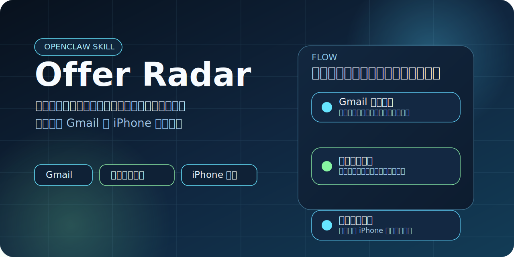

# OpenClaw Offer Radar



> 一个优先服务中文 Gmail 与 iPhone 提醒场景的 OpenClaw Skill：帮助用户从招聘邮件里提取真正重要的事件信息。

[](./SKILL.md)
[](./scripts/recruiting_sync.py)
[](./README.md)
[](./LICENSE)

## 这是什么

`OpenClaw Offer Radar` 是一个面向中文用户的招聘邮件处理 skill。

它当前聚焦一条很明确的链路：

`招聘邮件 -> 重要事件识别 -> 提醒体验`

## 使用场景

如果你最近在找实习、校招或者社招，应该很容易碰到这种情况：

- 邮箱里消息很多，但真正重要的只有那几封
- 一堆投递反馈、流程通知、广告和系统邮件混在一起，想找关键消息很费劲
- 面试、笔试、测评、授权、材料补交全混在一起
- 同一个事情还会来好几封更新邮件，看着像新消息，其实说的是同一件事
- 等你想回头找的时候，最重要的时间点反而最容易漏

这个 skill 更像是在帮你做一件很朴素的事：

把那些“真的会影响你接下来安排”的招聘邮件捞出来，整理成更适合放进原生提醒事项里的事件。这样既更容易找，也更不容易忘记时间。

## 需求说明

它想解决的不是“帮你读完所有邮件”，而是下面这些更现实的问题：

- 真正重要的是“什么时候面试”“什么时候笔试”“什么时候截止”
- 有些邮件只是投递成功、流程通知、问卷回访，这种不值得进提醒事项
- 同一个事件可能会收到邀请、更新、确认几封邮件，但你只想看到一个清楚的结果
- 最后写进提醒事项里的内容，应该是中文、简洁、能直接看懂，还最好顺手能点开链接
- 面试信息如果能直接进手机原生提醒里，查找和记时间都会轻松很多

这个仓库当前先聚焦招聘邮件这一条高价值场景，后续会继续往更普适的方向演进。

## 当前范围

目前 README 故意只写高层信息，因为识别规则、接入方式和实现细节还会继续改。

当前重点是：

- Gmail 招聘邮件筛选
- 面试 / 笔试 / 测评 / 授权类事件识别
- 中文事件整理
- 提醒事项同步

## 快速开始

当前示例环境：

- macOS
- Gmail
- Apple Mail
- Apple Reminders
- `gog`

运行一次扫描：

```bash
python3 scripts/recruiting_sync.py \
  --account your@gmail.com \
  --mail-account 谷歌
```

同步到提醒事项：

```bash
python3 scripts/recruiting_sync.py \
  --account your@gmail.com \
  --mail-account 谷歌 \
  --sync-reminders
```

## 仓库结构

```text
openclaw-offer-radar/
├── README.md
├── SKILL.md
├── LICENSE
├── agents/
├── assets/
└── scripts/
```

## 说明

- 当前仓库优先围绕 Gmail 场景设计
- 当前示例实现使用了 Apple 生态中的提醒能力
- 规则、模板和接入方式仍在持续迭代

## License

[MIT](./LICENSE)
